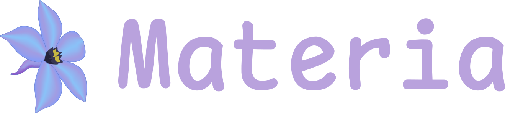

# Materia

<style>
.md-content .md-typeset h1 { display: none; }
</style>

<p align="center">
  <a href="https://materia.elnafo.ru"></a>
</p>
<p align="center">
  
  <a href="https://bonfire.cachix.org"></a>
</p>
<p align="center">
    <strong><em>Materia is a simple and fast cloud storage</em></strong>
</p>

**Documentation**: [https://materia.elnafo.ru/docs](https://materia.elnafo.ru/docs)

**Source**: [https://vcs.elnafo.ru/L-Nafaryus/materia](https://vcs.elnafo.ru/L-Nafaryus/materia)

Materia is a modern and high-performance cloud storage (thanks to FastAPI and Vue) built with REST in mind.

/// warning

This project is still in development. 
You can test it but at your own risk. 

You can also create an [issue](https://github.com/L-Nafaryus/materia/issues).

///

## Example 

### Standalone backend server 

/// warning

The project is currently unstable for packaging due to the complex setup. 
So the best way is to use the sources. 
It also uses a specific development environment via Nix. 
Tools like Podman can easily be replaced with Docker, so be careful.

///

First of all you need to prepare working instances of Postgres (database) and Redis (broker). There are many ways, you can choose any.

- Postgres:

```sh 
nix build .#postgresql-devel
podman load < result
podman run -p 54320:5432 --name database -dt postgresql:latest
```

- Redis:

```sh 
nix build .#redis-devel
podman load < result
podman run -p 63790:6379 --name cache -dt redis:latest
```

- Development environment:

```sh 
nix develop
pdm install --dev
eval $(pdm venv activate)
```

- Running tests (pytest):

```sh 
pytest
```

- Running server:

```sh 
MATERIA_DATABASE__PORT=54320 MATERIA_CACHE__PORT=63790 materia start
```

- Generating configuration and starting with it:

```sh 
materia config export --path ./config.toml
materia start --config config.toml 
```

### Standalone frontend server 

The frontend does not include a client by default. It must be generated from the OpenAPI specification which in turn must be generated from the current state of the FastAPI application. After that you can safely run the Vite server or build the entire Vue project.

```sh 
nix develop
pdm install --dev
eval $(pdm venv activate)

materia export openapi --path workspaces/frontend/openapi.json

cd workspaces/frontend
npm install 
npm run openapi
```

- Running frontend server:

```sh 
npm run dev 
```

In development mode, the server is configured to the address and port of the backend server.

## Design

At the current stage, the PDM package manager is used, since it is the only one that copes well with the concept of a monorepository. At the output, two Python packages should be built - materia (backend server) and materia-frontend (which wraps a built version of the NPM package materia-frontend-vue). Documentation (optional) and the frontend are served through the backend server.

The target platform of the project is NixOS. This also indirectly affects the approach to choosing tools for developing the current project and the support priority. And only secondly, packaging components for registries such as pypi and others. Support for the rest is a matter of time.

## Build 

All build steps are wrapped in PDM pre-build scripts, so in a typical case you only need PDM and NodeJS.

- materia:

```sh 
nix develop 
pdm build --skip ":all"
```

- materia with documentation:

```sh 
nix develop 
pdm install --prod --no-default --group docs
pdm build
```

- materia-frontend:

```sh 
nix develop 
pdm install --prod
cd workspaces/frontend
pdm build
```

## License

**materia** is licensed under the terms of the [MIT License](https://vcs.elnafo.ru/L-Nafaryus/materia/src/branch/master/LICENSE).
